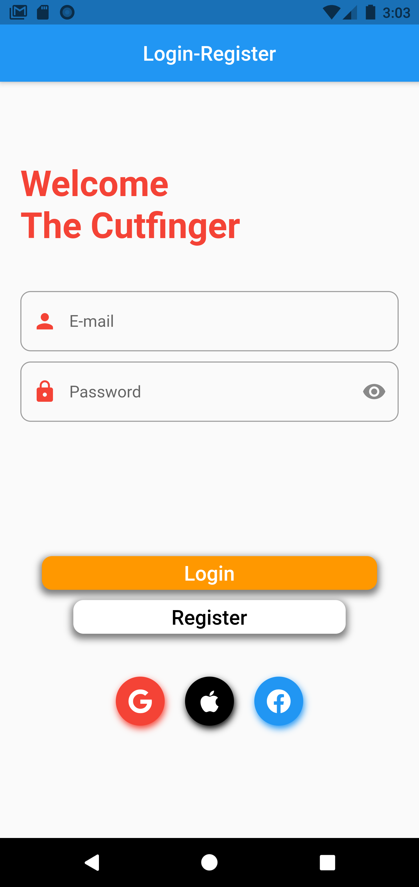
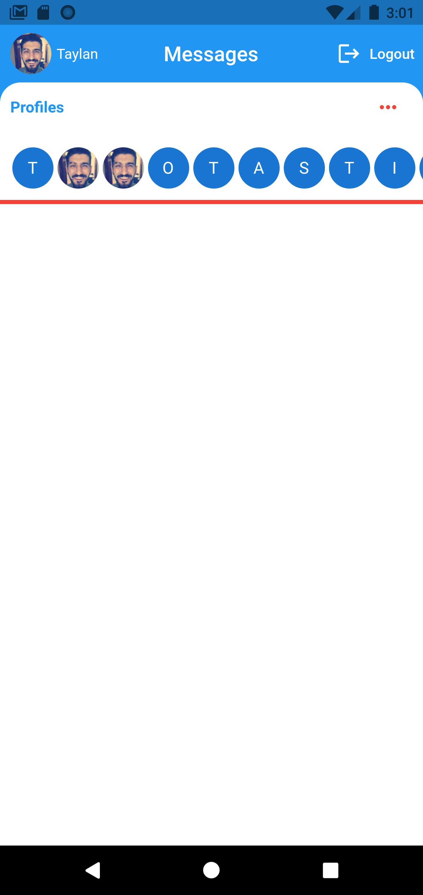

# firebase get all user account.

This project get all user from Firebase

## Screenshot

<br/>

### Database service class

```dart
class FirebaseDataService {
  final String? uid;

  FirebaseDataService({this.uid});

  final CollectionReference _reference =
      FirebaseFirestore.instance.collection('users');

  Future createUser(String? name, String? email, String? profile) async {
    return _reference.doc(uid).set({
      'name': name,
      'email': email,
      'profile': profile,
    });
  }

  List<UserModel> _userListFromSnapshot(QuerySnapshot? snapshot) {
    return snapshot!.docs.map((DocumentSnapshot doc) {
      return UserModel(
           doc['name'] ?? '',
           doc['email'] ?? '',
           doc['profile'] ?? '',
        );
    }).toList();
  }

  Stream<List<UserModel?>?> get users {
    return _reference.snapshots().map(_userListFromSnapshot);
  }
}
```

### Get User from Firebase

```dart
Widget _listProfileUser(BuildContext context) {
    return StreamBuilder<List<UserModel?>?>(
      stream: FirebaseDataService().users,
      builder: (context, snapshot) {
        if (snapshot.hasData) {
          return ListView.builder(
            padding: EdgeInsets.symmetric(horizontal: 10.0),
            scrollDirection: Axis.horizontal,
            itemCount: snapshot.data!.length,
            itemBuilder: (context, index) {
              List<UserModel?> user = snapshot.data!;
              return user[index]!.profile != 'none'
                  ? Padding(
                      padding: const EdgeInsets.all(2.0),
                      child: CircleAvatar(
                        radius: 20.0,
                        backgroundColor: Colors.grey,
                        backgroundImage: NetworkImage(user[index]!.profile),
                      ),
                    )
                  : Padding(
                      padding: const EdgeInsets.all(2.0),
                      child: CircleAvatar(
                        radius: 20.0,
                        child: Text(
                            user[index]!.email.split('@')[0][0].toUpperCase()),
                      ),
                    );
            },
          );
        } else {
          return Container();
        }
      },
    );
  }
```

## Getting Started

This project is a starting point for a Flutter application.

A few resources to get you started if this is your first Flutter project:

- [Lab: Write your first Flutter app](https://flutter.dev/docs/get-started/codelab)
- [Cookbook: Useful Flutter samples](https://flutter.dev/docs/cookbook)

For help getting started with Flutter, view our
[online documentation](https://flutter.dev/docs), which offers tutorials,
samples, guidance on mobile development, and a full API reference.
